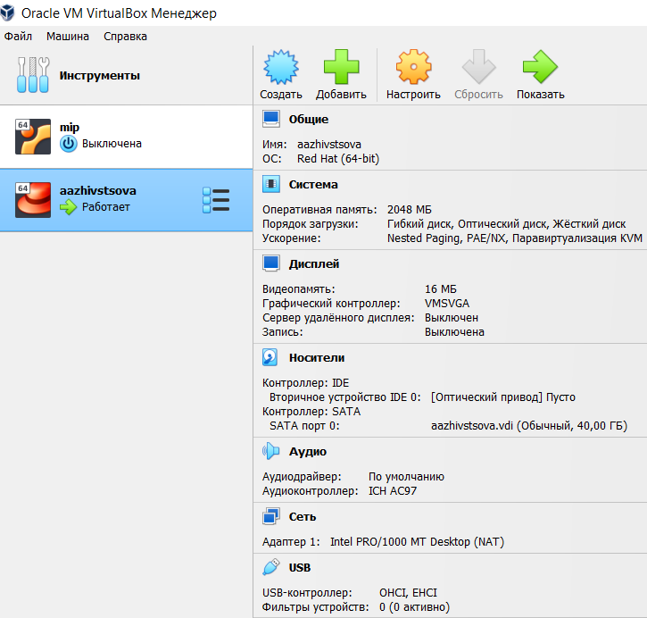
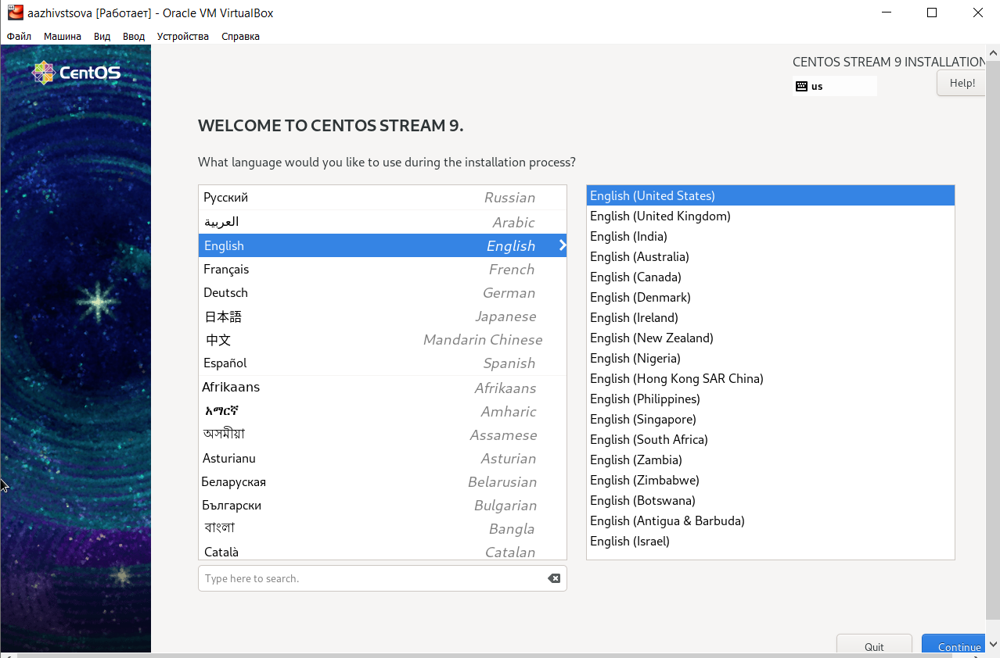
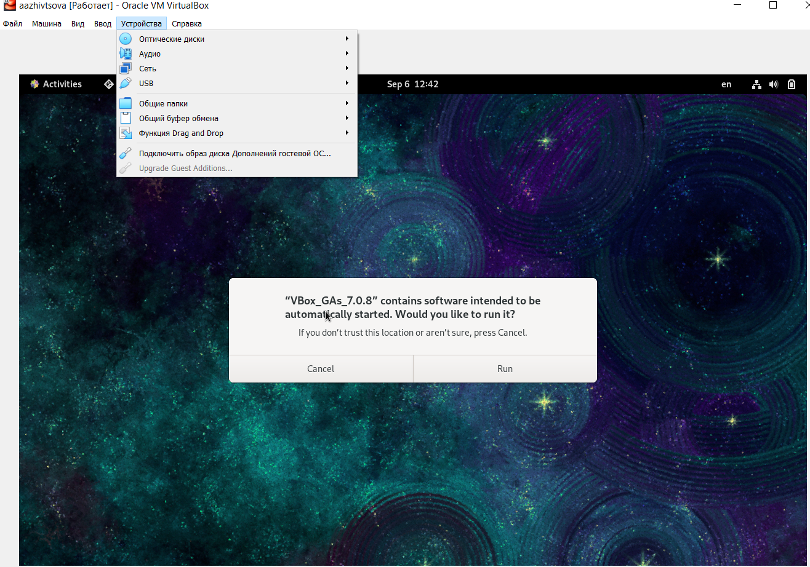
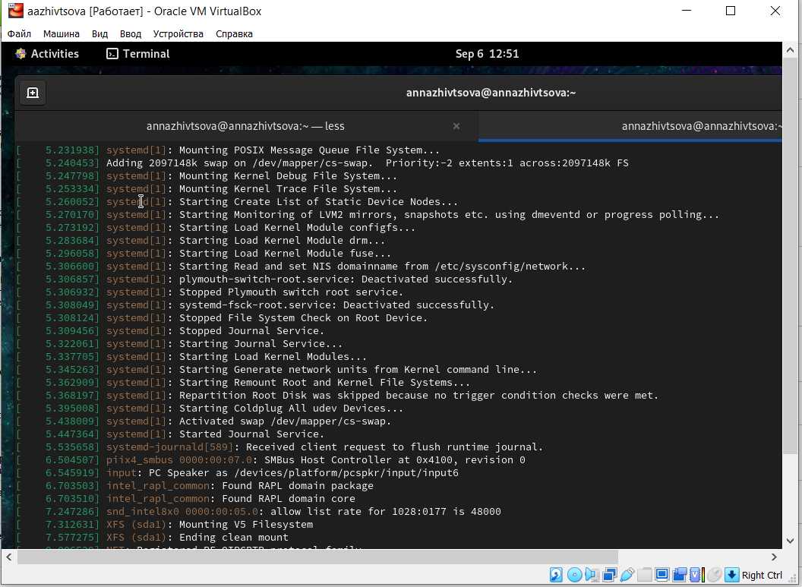
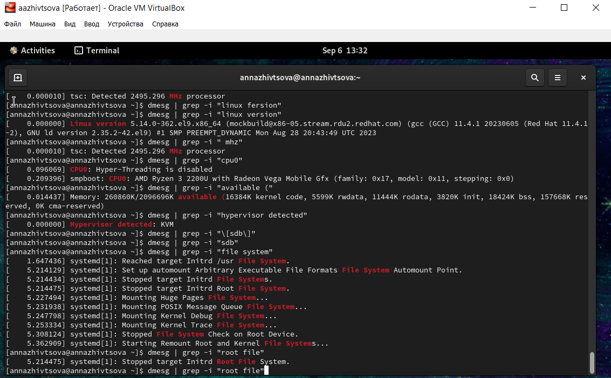
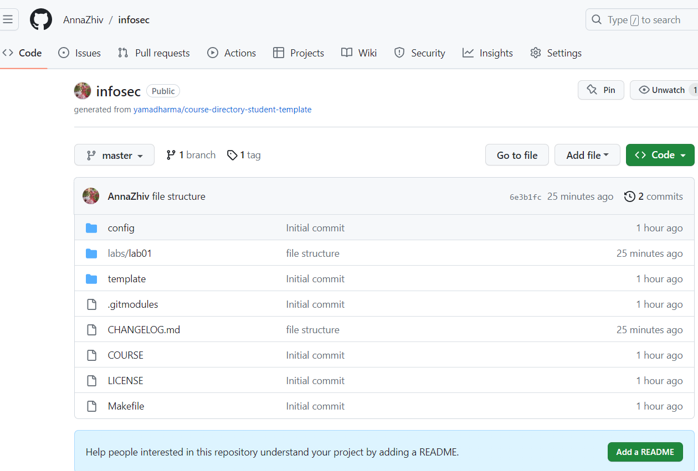
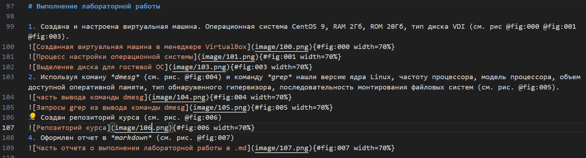

---
## Front matter
title: "Отчёт по лабораторной работе"
subtitle: "Лабораторная работа № 1"
author: "Живцова Анна"

## Generic otions
lang: ru-RU
toc-title: "Содержание"

## Bibliography
bibliography: cite.bib
csl: pandoc/csl/gost-r-7-0-5-2008-numeric.csl

## Pdf output format
toc: true # Table of contents
toc-depth: 2
lof: true # List of figures
lot: true # List of tables
fontsize: 12pt
linestretch: 1.5
papersize: a4
documentclass: scrreprt
## I18n polyglossia
polyglossia-lang:
  name: russian
  options:
	- spelling=modern
	- babelshorthands=true
polyglossia-otherlangs:
  name: english
## I18n babel
babel-lang: russian
babel-otherlangs: english
## Fonts
mainfont: PT Serif
romanfont: PT Serif
sansfont: PT Sans
monofont: PT Mono
mainfontoptions: Ligatures=TeX
romanfontoptions: Ligatures=TeX
sansfontoptions: Ligatures=TeX,Scale=MatchLowercase
monofontoptions: Scale=MatchLowercase,Scale=0.9
## Biblatex
biblatex: true
biblio-style: "gost-numeric"
biblatexoptions:
  - parentracker=true
  - backend=biber
  - hyperref=auto
  - language=auto
  - autolang=other*
  - citestyle=gost-numeric
## Pandoc-crossref LaTeX customization
figureTitle: "Рис."
tableTitle: "Таблица"
listingTitle: "Листинг"
lofTitle: "Список иллюстраций"
lotTitle: "Список таблиц"
lolTitle: "Листинги"
## Misc options
indent: true
header-includes:
  - \usepackage{indentfirst}
  - \usepackage{float} # keep figures where there are in the text
  - \floatplacement{figure}{H} # keep figures where there are in the text
---

# Цель работы

Подготовить рабочее пространство для выполнения последующих работ. 
Повторить основы markdown разметки. Настроить работу с удаленным Git репозиторием.  

# Задание

Установить виртуальную машину с операционной системой Linux. Произвести первичную настройку машины. Создать унифицированное рабочее пространство для выполнения лабораторных работ по дисциплине "Информационная безопасность". Оформить отчет о проделанной работе в соответствии с имеющимся шаблоном выполнения работ.

# Теоретическое введение

**Linux**  — семейство Unix-подобных операционных систем на базе ядра Linux, включающих тот или иной набор утилит и программ проекта GNU, и, возможно, другие компоненты. Как и ядро Linux, системы на его основе, как правило, создаются и распространяются в соответствии с моделью разработки свободного и открытого программного обеспечения. GNU/Linux-системы распространяются в основном бесплатно в виде различных дистрибутивов — в форме, готовой для установки и удобной для сопровождения и обновлений, — и имеющих свой набор системных и прикладных компонентов, как свободных, так и проприетарных. Детальнее в @robachevsky:unix. 

> **Markdown** — облегчённый язык разметки, созданный с целью обозначения форматирования в простом тексте, с максимальным сохранением его читаемости человеком.     
> **GitHub** — крупнейший веб-сервис для хостинга IT-проектов и их совместной разработки.
Веб-сервис основан на системе контроля версий Git и разработан на Ruby on Rails и Erlang компанией GitHub, Inc (ранее Logical Awesome), принадлежит компании Microsoft.    

Для комфортной работы с удаленным репозиторием на *github*, компьютер должен быть связан с системой контроля версий по SSH (протокол Secure Shell). При подключении через SSH проверка подлинности выполняется с помощью файла закрытого ключа на локальном компьютере. 

Для конвертации markdown отчета в форматы pdf и docx на компьютере должен быть установлен *pandoc*. На входе система pandoc может получать форматы: markdown, reStructuredText, HTML, LaTeX, OPML, Org-mode, DocBook, и Office Open XML (Microsoft Word .docx). И конвертировать их в:
- форматы на основе HTML: XHTML, HTML5, HTML-слайды презентаций (S5, Slidy, Slideous, DZSlides).    
- форматы текстовых процессоров: Microsoft Word docx, OpenOffice/LibreOffice ODT, OpenDocument XML    
- электронные книги: EPUB версии 2 или 3, FictionBook2    
- форматы технической документации: DocBook, GNU TexInfo, groff    
- форматы системы tex: LaTeX, ConTeXt, слайды LaTeX Beamer    
- PDF (с помощью LaTeX)    
- текстовые форматы с облегчённой разметкой: Markdown, reStructuredText, AsciiDoc, MediaWiki, Emacs Org-Mode, Textile     

# Выполнение лабораторной работы

1. Создана и настроена @gnu-doc:bash виртуальная машина. Операционная система CentOS 9, RAM 2Гб, ROM 20Гб, тип диска VDI (см. рис @fig:000 @fig:001 @fig:003). 

{#fig:000 width=70%}

{#fig:001 width=70%}

{#fig:003 width=70%}

2. Используя коману *dmesg* (см. рис. @fig:004) и команду *grep* нашли версию ядра Linux, частоту процессора, модель процессора, объем доступной оперативной памяти, тип обнаруженного гипервизора, последовательность монтирования файловых систем (см. рис. @fig:005).

{#fig:004 width=70%}

{#fig:005 width=70%}

3. Создан репозиторий курса (см. рис. @fig:006)

{#fig:006 width=70%}

4. Оформлен отчет в *markdown* (см. рис. @fig:007)

{#fig:007 width=70%}

# Выводы

Установлена виртуальная машина. Настроено рабочее пространство. Оформлен репозиторий. Освежены в памяти основные команды Git и синтаксис markdown.  

# Список литературы{.unnumbered}

:::{#refs}
:::   
