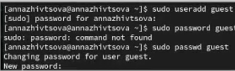
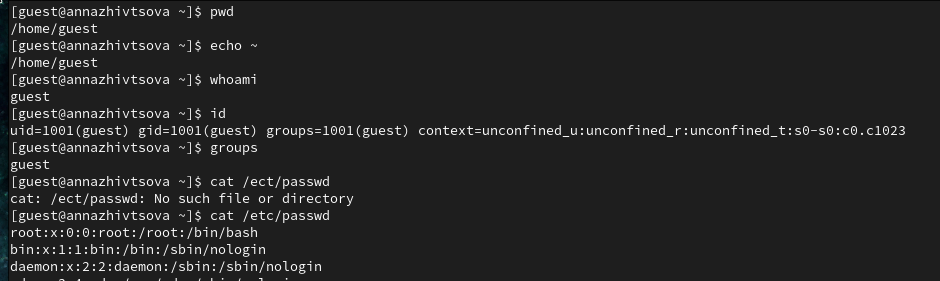
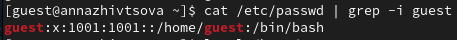
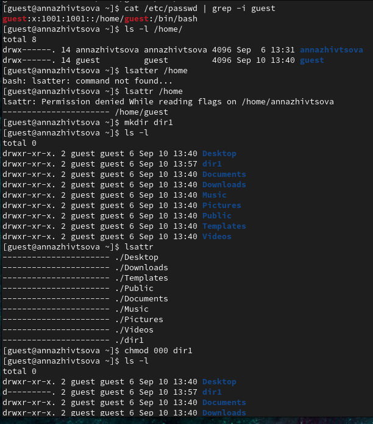
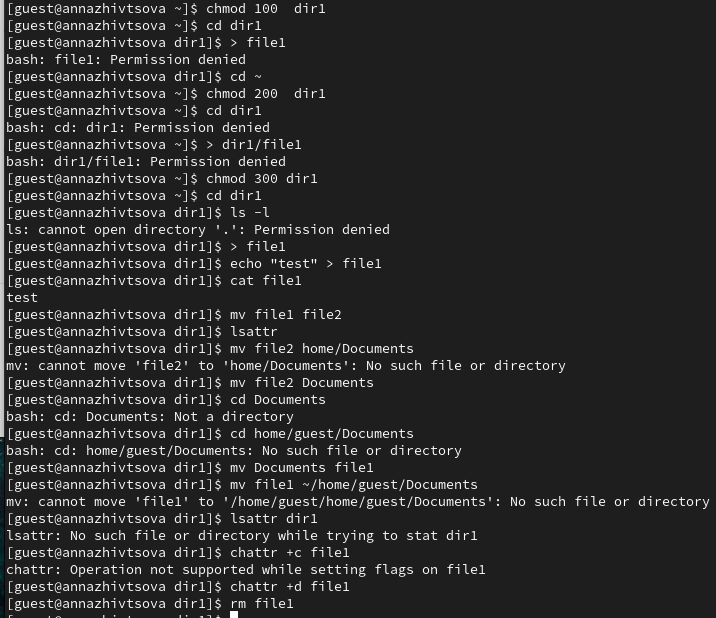
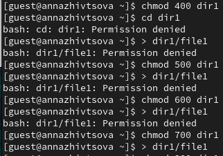

---
## Front matter
title: "Отчёт по лабораторной работе"
subtitle: "Лабораторная работа № 2"
author: "Живцова Анна"

## Generic otions
lang: ru-RU
toc-title: "Содержание"

## Bibliography
bibliography: cite.bib
csl: pandoc/csl/gost-r-7-0-5-2008-numeric.csl

## Pdf output format
toc: true # Table of contents
toc-depth: 2
lof: true # List of figures
lot: true # List of tables
fontsize: 12pt
linestretch: 1.5
papersize: a4
documentclass: scrreprt
## I18n polyglossia
polyglossia-lang:
  name: russian
  options:
	- spelling=modern
	- babelshorthands=true
polyglossia-otherlangs:
  name: english
## I18n babel
babel-lang: russian
babel-otherlangs: english
## Fonts
mainfont: PT Serif
romanfont: PT Serif
sansfont: PT Sans
monofont: PT Mono
mainfontoptions: Ligatures=TeX
romanfontoptions: Ligatures=TeX
sansfontoptions: Ligatures=TeX,Scale=MatchLowercase
monofontoptions: Scale=MatchLowercase,Scale=0.9
## Biblatex
biblatex: true
biblio-style: "gost-numeric"
biblatexoptions:
  - parentracker=true
  - backend=biber
  - hyperref=auto
  - language=auto
  - autolang=other*
  - citestyle=gost-numeric
## Pandoc-crossref LaTeX customization
figureTitle: "Рис."
tableTitle: "Таблица"
listingTitle: "Листинг"
lofTitle: "Список иллюстраций"
lotTitle: "Список таблиц"
lolTitle: "Листинги"
## Misc options
indent: true
header-includes:
  - \usepackage{indentfirst}
  - \usepackage{float} # keep figures where there are in the text
  - \floatplacement{figure}{H} # keep figures where there are in the text
---

# Цель работы

Получение практических навыков работы в консоли с атрибутами файлов, закрепление теоретических основ дискреционного разграничения доступа в современных системах с открытым кодом на базе ОС Linux.    

# Теоретическое введение

Каждый файл или каталог имеет права доступа, обозначаемые комбинацией букв латинского (обозначает разрешение) алфавита и знаков --(обозначает отсутствие разрешения). Для файла: r — разрешено чтение, w — разрешена запись, x — разрешено выполнение, для каталога: r — разрешён просмотр списка входящих файлов, w — разрешены создание и удаление файлов, x — разрешён доступ в каталог и есть возможность сделать его текущим, - — право доступа отсутствует. В сведениях о файле или каталоге указываются:
– тип файла (символ (-) обозначает файл, а символ (d) — каталог);    
– права для владельца файла;     
– права для членов группы;     
– права для всех остальных @robachevsky:unix @tannenbaum:modern-os:ru.     


# Выполнение лабораторной работы

1. Создали гостувую учетную запись и задали пароль (см. рис. @fig:00). Дальнейшие операции производили из этой записи.    

{#fig:000 width=70%}    

2. При включении оказались в домашней директории ```/home/guest ``` (см. рис. @fig:002). Проверили имя пользователя, его uid и gid двумя способами: командой ``` id``` и просмотром файла ``` /etc/passwd`` (см. рис. @fig:002 @fig:001)     

{#fig:002 width=70%}    

{#fig:001 width=70%}    

3. Не удалоось получить полный список поддиректорий директории /home и список их расширенных атрибутов для основного пользователя (см. рис. @fig:003) 

4. В созданном каталоге по умолчанию были выставлены все права для владельца, чтение и выполнение для группы, выполнение для прочих пользователей и никаких расширенных атрибутов (см. рис. @fig:003). 

5. При снятии с созданной директории атрибутов не удалось не то что записать туда новый файл, но и открыть директорию т.к. права были отозваны даже у создателя каталога (см. рис. @fig:003).

{#fig:003 width=70%}   

6. 

\begin{table}
\caption{Возможность операции с разными правами доступа}
\begin{tabular}{|c|c|c|c|c|c|c|c|c|} \hline
Права директории    & 000 & 100 & 200 & 300 & 400 & 500 & 600 & 700 \\ \hline         
Просмотр директории &  -  &  -  &  -  &  -  &  +  &  +  &  +  &  +  \\ \hline           
Создание файла      &  -  &  -  &  -  &  +  &  -  &  -  &  -  &  +   \\ \hline          
Запись в файл       &  -  &  -  &  -  &  +  &  -  &  -  &  -  &  +  \\ \hline           
Чтение из файла     &  -  &  -  &  -  &  +  &  -  &  -  &  -  &  +  \\ \hline       
Смена директории    &  -  &  -  &  -  &  +  &  -  &  -  &  -  &  +  \\ \hline       
Переименоване файла &  -  &  -  &  -  &  +  &  -  &  -  &  -  &  +  \\ \hline      
Смена атрибутов     &  -  &  -  &  -  &  +  &  -  &  -  &  -  &  +  \\ \hline      
Удаление файла      &  -  &  -  &  -  &  +  &  -  &  -  &  -  &  +  \\ \hline   
\end{tabular}
\end{table}

{#fig:004 width=70%}     

{#fig:005 width=70%}      


7. Для всех операций с файлами внутри каталога минимально должны быть установлены w + x права.  

# Выводы

Повторены основы установления прав доступа на каталоги и изучено влияение прав доступа на операции с файлами каталогов.  Закрепили теоретические основы дискреционного разграничения доступа в современных системах с открытым кодом на базе ОС Linux.    

# Список литературы{.unnumbered}

:::{#refs}
:::   
