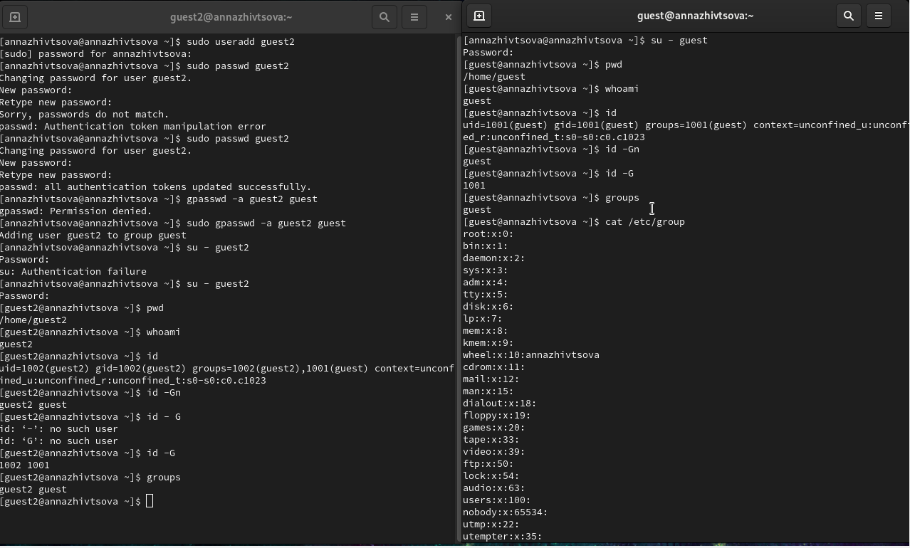
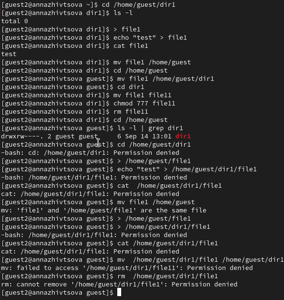
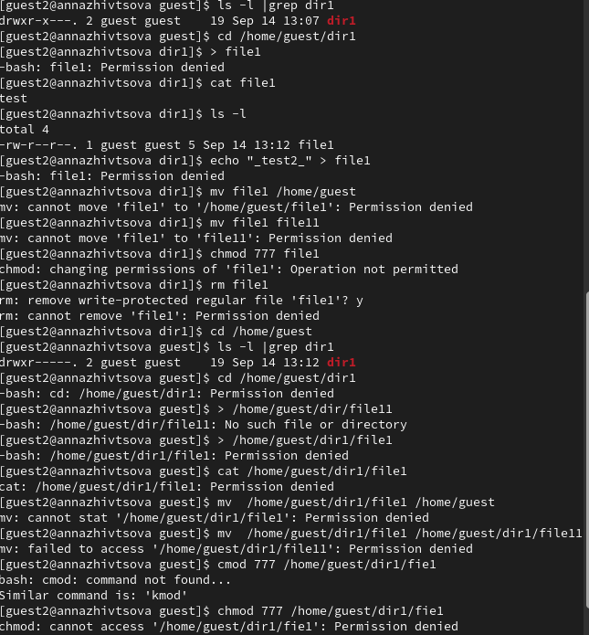
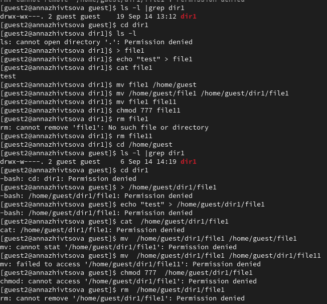
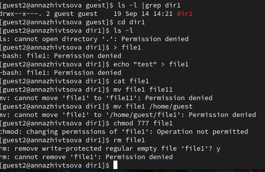

---
## Front matter
title: "Отчёт по лабораторной работе"
subtitle: "Лабораторная работа № 3"
author: "Живцова Анна"

## Generic otions
lang: ru-RU
toc-title: "Содержание"

## Bibliography
bibliography: cite.bib
csl: pandoc/csl/gost-r-7-0-5-2008-numeric.csl

## Pdf output format
toc: true # Table of contents
toc-depth: 2
lof: true # List of figures
lot: true # List of tables
fontsize: 12pt
linestretch: 1.5
papersize: a4
documentclass: scrreprt
## I18n polyglossia
polyglossia-lang:
  name: russian
  options:
	- spelling=modern
	- babelshorthands=true
polyglossia-otherlangs:
  name: english
## I18n babel
babel-lang: russian
babel-otherlangs: english
## Fonts
mainfont: PT Serif
romanfont: PT Serif
sansfont: PT Sans
monofont: PT Mono
mainfontoptions: Ligatures=TeX
romanfontoptions: Ligatures=TeX
sansfontoptions: Ligatures=TeX,Scale=MatchLowercase
monofontoptions: Scale=MatchLowercase,Scale=0.9
## Biblatex
biblatex: true
biblio-style: "gost-numeric"
biblatexoptions:
  - parentracker=true
  - backend=biber
  - hyperref=auto
  - language=auto
  - autolang=other*
  - citestyle=gost-numeric
## Pandoc-crossref LaTeX customization
figureTitle: "Рис."
tableTitle: "Таблица"
listingTitle: "Листинг"
lofTitle: "Список иллюстраций"
lotTitle: "Список таблиц"
lolTitle: "Листинги"
## Misc options
indent: true
header-includes:
  - \usepackage{indentfirst}
  - \usepackage{float} # keep figures where there are in the text
  - \floatplacement{figure}{H} # keep figures where there are in the text
---

# Цель работы

Получение практических навыков работы в консоли с атрибутами файлов для групп пользователей.     

# Теоретическое введение

Каждый файл или каталог имеет права доступа, обозначаемые комбинацией букв латинского (обозначает разрешение) алфавита и знаков --(обозначает отсутствие разрешения). Для файла: r — разрешено чтение, w — разрешена запись, x — разрешено выполнение, для каталога: r — разрешён просмотр списка входящих файлов, w — разрешены создание и удаление файлов, x — разрешён доступ в каталог и есть возможность сделать его текущим, - — право доступа отсутствует. В сведениях о файле или каталоге указываются:
– тип файла (символ (-) обозначает файл, а символ (d) — каталог);    
– права для владельца файла;     
– права для членов группы;     
– права для всех остальных @robachevsky:unix @tannenbaum:modern-os:ru.     

# Выполнение лабораторной работы

1. Создали две гостувые учетные записи и объединили их в группу (см. рис. @fig:000).     

{#fig:000 width=90%}    

2. Меняя атрибуты доступа для группы, проверили выполне операций с файлом (см. рис. @fig:001).

{#fig:001 width=90%}      

{#fig:002 width=90%}    

{#fig:003 width=90%}     

{#fig:004 width=90%}     

2. 
\begin{table}
\caption{Возможность операций с разными правами доступа}
\begin{tabular}{|c|c|c|c|c|c|c|c|c|} \hline
Права директории    & 000 & 100 & 200 & 300 & 400 & 500 & 600 & 700 \\ \hline         
Просмотр директории &  -  &  -  &  -  &  -  &  -  &  +  &  -  &  +  \\ \hline           
Создание файла      &  -  &  -  &  -  &  +  &  -  &  -  &  -  &  +   \\ \hline          
Запись в файл       &  -  &  -  &  -  &  +  &  -  &  -  &  -  &  +  \\ \hline           
Чтение из файла     &  -  &  +  &  -  &  +  &  -  &  +  &  -  &  +  \\ \hline       
Смена директории    &  -  &  -  &  -  &  +  &  -  &  -  &  -  &  +  \\ \hline       
Переименоване файла &  -  &  -  &  -  &  +  &  -  &  -  &  -  &  +  \\ \hline      
Смена атрибутов     &  -  &  -  &  -  &  +  &  -  &  -  &  -  &  +  \\ \hline      
Удаление файла      &  -  &  -  &  -  &  +  &  -  &  -  &  -  &  +  \\ \hline   
\end{tabular}
\end{table}    

3. 
\begin{table}
\caption{Минимальные права для операций}
\begin{tabular}{|c|c|} \hline                
Создание файла      &  wx   \\ \hline          
Запись в файл       &  wx  \\ \hline           
Чтение из файла     &  x  \\ \hline       
Смена директории    &  wx \\ \hline       
Переименоване файла &  wx  \\ \hline      
Смена атрибутов     &  wx  \\ \hline      
Удаление файла      &  wx  \\ \hline   
\end{tabular}
\end{table}     

# Выводы

Повторены основы установления прав доступа на каталоги и изучено влияение прав доступа на операции с файлами каталогов.  Закрепили теоретические основы дискреционного разграничения доступа в современных системах с открытым кодом на базе ОС Linux.    

# Список литературы{.unnumbered}

:::{#refs}
:::   
