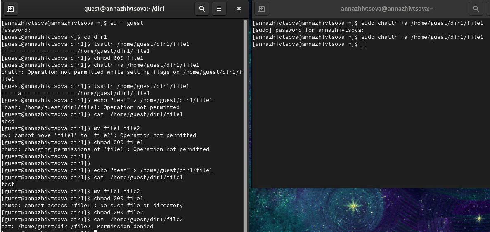
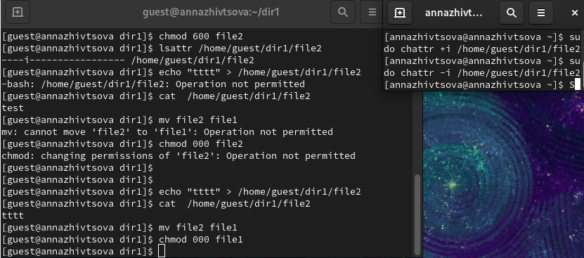

---
## Front matter
title: "Отчёт по лабораторной работе"
subtitle: "Лабораторная работа № 4"
author: "Живцова Анна"

## Generic otions
lang: ru-RU
toc-title: "Содержание"

## Bibliography
bibliography: cite.bib
csl: pandoc/csl/gost-r-7-0-5-2008-numeric.csl

## Pdf output format
toc: true # Table of contents
toc-depth: 2
lof: true # List of figures
lot: true # List of tables
fontsize: 12pt
linestretch: 1.5
papersize: a4
documentclass: scrreprt
## I18n polyglossia
polyglossia-lang:
  name: russian
  options:
	- spelling=modern
	- babelshorthands=true
polyglossia-otherlangs:
  name: english
## I18n babel
babel-lang: russian
babel-otherlangs: english
## Fonts
mainfont: PT Serif
romanfont: PT Serif
sansfont: PT Sans
monofont: PT Mono
mainfontoptions: Ligatures=TeX
romanfontoptions: Ligatures=TeX
sansfontoptions: Ligatures=TeX,Scale=MatchLowercase
monofontoptions: Scale=MatchLowercase,Scale=0.9
## Biblatex
biblatex: true
biblio-style: "gost-numeric"
biblatexoptions:
  - parentracker=true
  - backend=biber
  - hyperref=auto
  - language=auto
  - autolang=other*
  - citestyle=gost-numeric
## Pandoc-crossref LaTeX customization
figureTitle: "Рис."
tableTitle: "Таблица"
listingTitle: "Листинг"
lofTitle: "Список иллюстраций"
lotTitle: "Список таблиц"
lolTitle: "Листинги"
## Misc options
indent: true
header-includes:
  - \usepackage{indentfirst}
  - \usepackage{float} # keep figures where there are in the text
  - \floatplacement{figure}{H} # keep figures where there are in the text
---

# Цель работы

Получение практических навыков работы в консоли с расширенными атрибутами файлов.      

# Теоретическое введение

Каждый файл или каталог имеет права доступа, обозначаемые комбинацией букв латинского (обозначает разрешение) алфавита и знаков --(обозначает отсутствие разрешения). Для файла: r — разрешено чтение, w — разрешена запись, x — разрешено выполнение, для каталога: r — разрешён просмотр списка входящих файлов, w — разрешены создание и удаление файлов, x — разрешён доступ в каталог и есть возможность сделать его текущим, - — право доступа отсутствует. В сведениях о файле или каталоге указываются:
– тип файла (символ (-) обозначает файл, а символ (d) — каталог);    
– права для владельца файла;     
– права для членов группы;      
– права для всех остальных @robachevsky:unix.     

Каждый файл имеет возможность задания ряда атрибутов:    
- a - файл может быть открыт только в режиме добавления;    
- A - не обновлять время перезаписи;    
- c - автоматически сжимать при записи на диск;    
- C - отключить копирование при записи;    
- D - работает только для папки, когда установлен, все изменения синхронно записываются на диск сразу же;    
- e - использовать extent'ы блоков для хранения файла;    
- i - сделать неизменяемым;    
- j - все данные перед записью в файл будут записаны в журнал;    
- s - безопасное удаление с последующей перезаписью нулями;    
- S - синхронное обновление, изменения файлов с этим атрибутом будут сразу же записаны на диск;    
- t - файлы с этим атрибутом не будут хранится в отдельных блоках;     
- u - содержимое файлов с этим атрибутом не будет удалено при удалении самого файла и потом может быть восстановлено @tannenbaum:modern-os:ru .   

# Выполнение лабораторной работы

Создали файл с правами доступа 600 и, измененяя атрибуты через суперпользователя, протестировали возможность записи, открытия, переименования и установления прав доступа 000.    

С установленными атрибутами a и i не удалось записать данные в файл, переименовать файл или назначить право доступа 000. Без атрибутов операции выполнить удалось (см. рис. @fig:000 @fig:001).      

{#fig:000 width=90%}        

{#fig:001 width=90%}    

# Выводы

Повысили свои навыки использования интерфейса командой строки, познакомились на примерах с тем, как используются основные и расширенные атрибуты при разграничении доступа. Имели возможность связать теорию дискреционного разделения доступа (дискреционная политика безопасности) с её реализацией на практике в ОС Linux.       

# Список литературы{.unnumbered}

:::{#refs}
:::   
