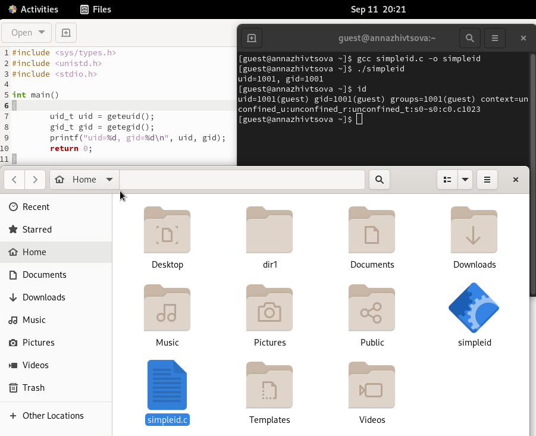
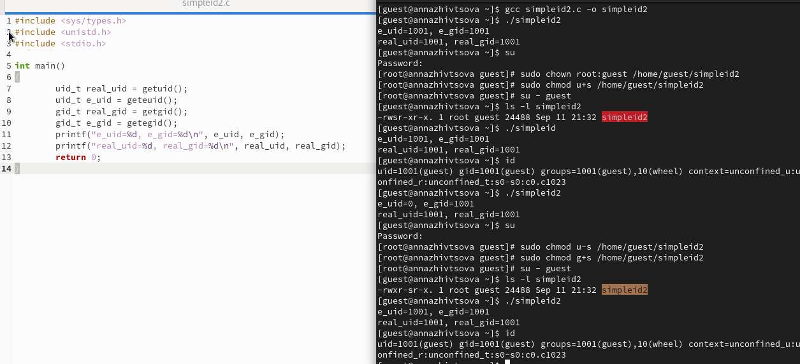
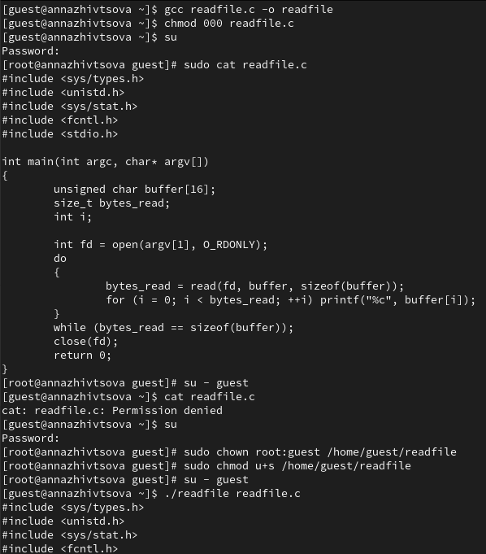
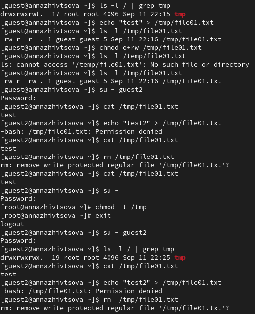

---
## Front matter
title: "Отчёт по лабораторной работе"
subtitle: "Лабораторная работа № 5"
author: "Живцова Анна"

## Generic otions
lang: ru-RU
toc-title: "Содержание"

## Bibliography
bibliography: cite.bib
csl: pandoc/csl/gost-r-7-0-5-2008-numeric.csl

## Pdf output format
toc: true # Table of contents
toc-depth: 2
lof: true # List of figures
lot: true # List of tables
fontsize: 12pt
linestretch: 1.5
papersize: a4
documentclass: scrreprt
## I18n polyglossia
polyglossia-lang:
  name: russian
  options:
	- spelling=modern
	- babelshorthands=true
polyglossia-otherlangs:
  name: english
## I18n babel
babel-lang: russian
babel-otherlangs: english
## Fonts
mainfont: PT Serif
romanfont: PT Serif
sansfont: PT Sans
monofont: PT Mono
mainfontoptions: Ligatures=TeX
romanfontoptions: Ligatures=TeX
sansfontoptions: Ligatures=TeX,Scale=MatchLowercase
monofontoptions: Scale=MatchLowercase,Scale=0.9
## Biblatex
biblatex: true
biblio-style: "gost-numeric"
biblatexoptions:
  - parentracker=true
  - backend=biber
  - hyperref=auto
  - language=auto
  - autolang=other*
  - citestyle=gost-numeric
## Pandoc-crossref LaTeX customization
figureTitle: "Рис."
tableTitle: "Таблица"
listingTitle: "Листинг"
lofTitle: "Список иллюстраций"
lotTitle: "Список таблиц"
lolTitle: "Листинги"
## Misc options
indent: true
header-includes:
  - \usepackage{indentfirst}
  - \usepackage{float} # keep figures where there are in the text
  - \floatplacement{figure}{H} # keep figures where there are in the text
---

# Цель работы

Изучение механизмов изменения идентификаторов, применения SetUID- и Sticky-битов. Получение практических навыков работы в консоли с дополнительными атрибутами. Рассмотрение работы механизма смены идентификатора процессов пользователей, а также влияние бита Sticky на запись и удаление файлов.    

# Теоретическое введение

Каждый файл или каталог имеет права доступа, обозначаемые комбинацией букв латинского (обозначает разрешение) алфавита и знаков --(обозначает отсутствие разрешения). Для файла: r — разрешено чтение, w — разрешена запись, x — разрешено выполнение, для каталога: r — разрешён просмотр списка входящих файлов, w — разрешены создание и удаление файлов, x — разрешён доступ в каталог и есть возможность сделать его текущим, - — право доступа отсутствует. В сведениях о файле или каталоге указываются:
– тип файла (символ (-) обозначает файл, а символ (d) — каталог);    
– права для владельца файла;     
– права для членов группы;      
– права для всех остальных @robachevsky:unix. 

В качестве дополнительных атрибутов могут выступать SUID, GUID и sticky биты. Разберем их подробнее.    

Бит SUID устанавливается на исполняемые файлы. После установки данного бита программа исполняется с правами доступа и привилегиями пользователя, который владеет соответствующим бинарным файлом.  В том случае, если владельцем бинарного файла является пользователь root, причем для файла установлен бит SUID, любой исполняющий данный файл пользователь будет иметь такие же права доступа, как и пользователь root.    

При установке бита GUID для исполняемых файлов будет достигаться такой же эффект, как и в случае установки бита SUID, за тем исключением, что вместо прав доступа пользователя, владеющего файлом, в процессе исполнения файла устанавливаются права доступа группы пользователей, владеющей файлом. Бит GUID используется главным образом по отношению к директориям. В том случае, если для директории устанавливается бит GUID, создаваемые в директории файлы наследуют идентификатор группы пользователей, владеющей директорией. Данный механизм очень полезен в случае работы группы пользователей с файлами из одной и той же директории.       

В директориях, для которых установлен бит sticky, активируется дополнительный слой защиты созданных файлов. В обычных условиях при доступе множества пользователей к содержимому директории каждый пользователь имеет возможность удаления файлов другого пользователя. (Это справедливо даже для того случая, когда пользователи не имеют прав на запись содержимого этих файлов!) В случае установки бита sticky для директории файлы могут удаляться лишь теми пользователями, которые владеют ими @tannenbaum:modern-os:ru .    

# Выполнение лабораторной работы

1. Создали простую программу на языке С для чтения uid и gid. Проверили ее работу, сравнив с системной утилитой id (см. рис. @fig:000).      

{#fig:000 width=90%}   

2. Усложнили программу, добавив вывод действительных идентификаторов. Командой ``` chown root:guest /home/guest/simpleid2``` передали права обладания файлов суперпользователю. Командами ``` chmod u+s /home/guest/simpleid2``` и ``` chmod g+s /home/guest/simpleid2``` присвоили файлу SUID и GUID биты. Проверили функционирование. И правда, при выполнении с правами суперпользователя uid указывается суперпользователя (см. рис. @fig:001). Так как мы не меняли группу файла, изменений в программе при выставлении GUID не наблюдается.   

{#fig:001 width=90%}     

3. Создали программу для чтения файлов. Установили на текст программы права доступа 000. Установили владельцем исполняемого файла суперпользователя. Поставили SUID бит. Запустили исполняемый файл от обычного пользователя. Исполняемый файл смог прочесть текст программы, у которого отсутствует разрешение для чтения (см. рис. @fig:002).    

{#fig:002 width=90%}     

4. Протестировали  действие Sticky-бита, установленного в каталоге /tmp. Убедились, что удаление файла доступно только создателю (см. рис. @fig:003).     

{#fig:003 width=90%}        

# Выводы

Изучили теорию механизмов изменения идентификаторов, применения SetUID, SetGID и Sticky-битов. Отработали на практике с помощью консоли влияние дополнительных атрибутов. Рассмотрели механизм смены идентификатора процессов пользователей, а также влияние бита Sticky на запись и удаление файлов.       

# Список литературы{.unnumbered}

:::{#refs}
:::   


