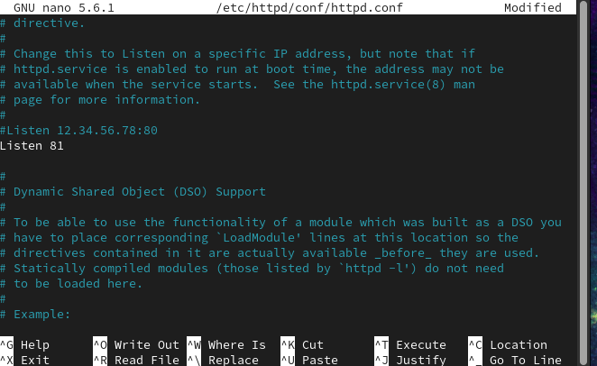

---
## Front matter
title: "Отчёт по лабораторной работе"
subtitle: "Лабораторная работа № 6"
author: "Живцова Анна"

## Generic otions
lang: ru-RU
toc-title: "Содержание"

## Bibliography
bibliography: cite.bib
csl: pandoc/csl/gost-r-7-0-5-2008-numeric.csl

## Pdf output format
toc: true # Table of contents
toc-depth: 2
lof: true # List of figures
lot: true # List of tables
fontsize: 12pt
linestretch: 1.5
papersize: a4
documentclass: scrreprt
## I18n polyglossia
polyglossia-lang:
  name: russian
  options:
	- spelling=modern
	- babelshorthands=true
polyglossia-otherlangs:
  name: english
## I18n babel
babel-lang: russian
babel-otherlangs: english
## Fonts
mainfont: PT Serif
romanfont: PT Serif
sansfont: PT Sans
monofont: PT Mono
mainfontoptions: Ligatures=TeX
romanfontoptions: Ligatures=TeX
sansfontoptions: Ligatures=TeX,Scale=MatchLowercase
monofontoptions: Scale=MatchLowercase,Scale=0.9
## Biblatex
biblatex: true
biblio-style: "gost-numeric"
biblatexoptions:
  - parentracker=true
  - backend=biber
  - hyperref=auto
  - language=auto
  - autolang=other*
  - citestyle=gost-numeric
## Pandoc-crossref LaTeX customization
figureTitle: "Рис."
tableTitle: "Таблица"
listingTitle: "Листинг"
lofTitle: "Список иллюстраций"
lotTitle: "Список таблиц"
lolTitle: "Листинги"
## Misc options
indent: true
header-includes:
  - \usepackage{indentfirst}
  - \usepackage{float} # keep figures where there are in the text
  - \floatplacement{figure}{H} # keep figures where there are in the text
---

# Цель работы

Развить навыки администрирования ОС Linux. Получить первое практическое знакомство с технологией SELinux. Проверить работу SELinx на практике совместно с веб-сервером Apache.    

# Теоретическое введение

Security-Enhanced Linux (SELinux) - это метод контроля доступа в Linux на основе модуля ядра Linux Security (LSM). SELinux включен по умолчанию во многих дистрибутивах на основе Red Hat, использующих пакетную базу rpm, например, Fedora, CentOS и т д.    

SELinux представляет собой систему маркировки, каждый процесс имеет метку. Каждый файл, каталог или даже пользователь в системе имеет метку. Даже портам и устройствам и именам хостов в системе присвоены метки. SELinux определяет правила доступа процесса к объектам с определенными метками. Это и называется политикой. За соблюдением правил следит ядро. Иногда это еще называется обязательный контроль доступа (Mandatory Access Control, MAC)    

Владелец файла не имеет полной свободы действий над атрибутами безопасности. Стандартные атрибуты контроля доступа, такие как группа и владелец ничего не значат для SELinux. Полностью все управляется метками. Значения атрибутов могут быть установлены и без прав root, но на это нужно иметь специальные полномочия SELinux @selinux .  

Apache - это популярнейший свободный веб-сервер. Состоянием на 2020 год он используется на 33% всех сайтов интернета, а это приблизительно 304 миллиарда сайтов. Этот веб-сервер был разработан в далеком 1995, как замена для популярного того сервера NCSA и исправил множество его проблем. Ходят слухи что его имя походит от a patchy, заплатка, так как он исправлял ошибки NCSA. Сейчас же, это кроссплатформенная программа, поддерживающая Windows, Linux и MacOS и обеспечивающая достаточную гибкость, настраиваемость и функциональность. Программа имеет модульную структуру, что позволяет расширять ее функциональность почти до бесконечности с помощью модулей   @apache .


# Выполнение лабораторной работы

1. Убедились, что SELinux работает в режиме enforcing при политике targeted. Установили и запустили web-сервер apache (см. рис. @fig:000).    

{#fig:000 width=90%}    

2. Получили контекст процесса Apache. Посмотрели текущее состояние переключателей SELinux для Apache (см. рис. @fig:001).    

{#fig:001 width=90%}    

3. Посмотрели статистику по политике с помощью команды seinfo (см. рис. @fig:002), определили множество пользователей, ролей, типов (см. рис. @fig:003).

{#fig:002 width=90%}    

{#fig:003 width=90%}    

4. Определили тип файлов и поддиректорий, находящихся в директориях
```/var/www ``` и ```/var/www/html ```. Для последней директории установлены права rwxr_xr_x. Создали в ней простой html файл. По умолчанию ему был присвоен контекст unconfined_u:object_r:httpd_sys_content_t:s0. Обратились к фйлу через браузер (см. рис. @fig:004).    

{#fig:004 width=90%}     

5. Изменили контекст созданного html файла на тот, к которому процесс httpd не
должен иметь доступа и получили ошибку при обращении к файлу через браузер (см. рис. @fig:005).    

{#fig:005 width=90%}     

6. Посмотрели лог файлы (см. рис. @fig:006).    

{#fig:006 width=90%}     

7. Запуститили веб-сервер Apache на прослушивание ТСР-порта (см. рис. @fig:007).    

{#fig:007 width=90%}     

8. Посмотрели лог файлы, недавно был обновлен файл ``` /var/log/http/error_log```  (см. рис. @fig:008).    

{#fig:008 width=90%}     

9. Выполнили поднастройку политики командой ``` semanage port -a -t http_port_t -р tcp 81```, вернули html файлу прежний контекст, обратились к нему из браузера (см. рис. @fig:009).    

{#fig:009 width=90%}     

10. Восстановление всех изменений (см. рис. @fig:010).

{#fig:010 width=90%}        

# Выводы

Развили навыки администрирования ОС Linux. Получили первое практическое знакомство с технологией SELinux. Проверили работу SELinx на практике совместно с веб-сервером Apache.         

# Список литературы{.unnumbered}

:::{#refs}
:::   
